<p align="center">
  <h1 align="center">ProofWeave</h1>
  <p align="center">
    <strong>AI 에이전트 생성 데이터의 온체인 출처 증명 + 결제 프로토콜</strong>
  </p>
  <p align="center">
    <a href="https://proofweave.vercel.app">Demo</a> ·
    <a href="#architecture">Architecture</a> ·
    <a href="#getting-started">Getting Started</a> ·
    <a href="#api-reference">API Reference</a>
  </p>
</p>

---

## Overview

**ProofWeave**는 AI 에이전트가 생성한 데이터의 **출처(provenance)를 온체인에 기록**하고, 다른 에이전트가 이를 **검증 후 결제하여 사용**할 수 있는 프로토콜입니다.

### 핵심 가치

| 가치 | 설명 |
|------|------|
| **AI 데이터 무결성** | 데이터가 언제, 어떤 모델에 의해 생성됐고, 등록 이후 위변조되지 않았음을 온체인 기록으로 보장 |
| **에이전트 결제 프로토콜** | 에이전트가 프로그래매틱하게 데이터를 검증하고 결제 — HTTP 호출만으로 완결 |
| **토큰 효율성** | 직접 크롤링/정리 시 ~50,000 토큰 → 정리된 데이터 구매 시 ~500 토큰 (**~90% 절약**) |

### 차별화

| 비교 대상 | ProofWeave 차이점 |
|-----------|-------------------|
| C2PA | 중앙 CA 의존 → ProofWeave는 탈중앙 온체인 |
| EAS | 범용 attestation, 결제 없음 → ProofWeave는 결제 통합 |
| x402 | 결제만 지원 → ProofWeave는 provenance + 결제 통합 |

---

## Architecture

```
┌─────────────────────────┐     ┌──────────────────────┐     ┌──────────────────┐
│   Frontend (Web)        │────▶│   Backend (API)      │────▶│  Base Sepolia     │
│   React + Vite + TS     │     │   Express + TS       │     │  (Smart Contract) │
│   Vercel                │     │   GCP Cloud Run      │     │  UUPS Proxy       │
└─────────────────────────┘     └──────────┬───────────┘     └──────────────────┘
                                           │
                              ┌────────────┼────────────┐
                              ▼            ▼            ▼
                        ┌──────────┐ ┌──────────┐ ┌──────────┐
                        │ Supabase │ │  Pinata  │ │  Coinbase│
                        │ Postgres │ │  (IPFS)  │ │  CDP     │
                        │ + Auth   │ │          │ │ (Wallet) │
                        └──────────┘ └──────────┘ └──────────┘
```

### 핵심 흐름: Register → Attest → Search → Pay → Access

```mermaid
sequenceDiagram
    participant Owner as 에이전트 소유자
    participant AgentA as Agent A (생산자)
    participant API as ProofWeave API
    participant IPFS as IPFS (Pinata)
    participant Chain as Base Sepolia
    participant AgentB as Agent B (소비자)

    rect rgb(40, 40, 60)
    Note over Owner, Chain: 사전 준비
    Owner->>API: POST /auth/register → API Key 발급
    Note right of API: CDP Smart Wallet 자동 생성
    end

    rect rgb(40, 50, 40)
    Note over AgentA, Chain: 데이터 등록 (Attest)
    AgentA->>API: POST /attest (원본 데이터 + API Key)
    API->>API: Canonical JSON → SHA-256 → contentHash
    API->>API: AES-256-GCM 암호화 (HKDF 파생키)
    API->>IPFS: 암호문 업로드
    API->>Chain: attest(contentHash, creator, aiModel, ipfsCid)
    API-->>AgentA: attestationId + txHash
    end

    rect rgb(40, 60, 40)
    Note over AgentB, Chain: 검색 → 결제 → 사용
    AgentB->>API: GET /search?q=defi+security
    API-->>AgentB: attestation 목록 (메타데이터)
    AgentB->>API: GET /attestations/{id}/detail
    API-->>AgentB: 402 Payment Required (x402)
    Note right of API: Smart Wallet에서 USDC 자동 결제
    API->>Chain: USDC transfer (ERC-4337)
    API->>API: AccessReceipt 발급
    API->>API: AES-256-GCM 복호화
    API-->>AgentB: 200 OK + 평문 데이터
    end
```



### 3계층 결제 아키텍처 (x402 호환)

| Layer | 역할 |
|-------|------|
| **Layer 1: x402 미들웨어** | 유료 리소스 요청 시 402 응답 생성, 결제 검증 |
| **Layer 2: ProofWeave Access Layer** | AccessReceipt 발급/검증, 재결제 방지, Delegated Pay |
| **Layer 3: 상세 데이터 장벽** | AES-256-GCM 복호화 → 평문 반환 |

---

## Tech Stack

| 영역 | 기술 | 설명 |
|------|------|------|
| **Smart Contract** | Solidity 0.8.28 + Foundry + OpenZeppelin | UUPS Proxy 패턴, Base Sepolia 배포 |
| **Backend API** | Express + TypeScript + viem | x402 결제 게이트, IPFS, 온체인 tx |
| **Frontend** | React 19 + Vite + TypeScript | SPA, Supabase Auth, recharts |
| **Database** | Supabase (PostgreSQL) | attestations, api_keys, 결제 원장 |
| **Storage** | Pinata (IPFS) | 암호화된 데이터 분산 저장 |
| **Wallet** | Coinbase CDP (ERC-4337) | 에이전트용 Smart Account 자동 결제 |
| **AI** | Gemini 3.1 Pro / 3 Flash / 2.5 Pro / 2.5 Flash | 멀티모델 선택, 모델별 일일 한도 (Pro 3회, Flash 10회) |
| **Crypto** | AES-256-GCM + HKDF-SHA256 | 서버사이드 암복호화 (attestation별 파생키) |
| **Deploy** | Vercel (Frontend) + GCP Cloud Run (API) | Docker 멀티스테이지 빌드 |

---

## Project Structure

```
proofweave/
├── src/                          # Smart Contracts (Solidity)
│   └── AttestationRegistry.sol   #   UUPS Proxy, 핵심 provenance 레지스트리
├── test/                         # Contract Tests (Foundry)
│   ├── unit/                     #   Attest, Verify, AccessControl
│   └── upgrade/                  #   UUPS 업그레이드 테스트
├── script/                       # Deployment Scripts
│   └── Deploy.s.sol              #   ERC1967Proxy + initialize
├── api/                          # Backend API (TypeScript)
│   ├── src/
│   │   ├── config/               #   환경변수, 체인 설정, CDP, Keychain
│   │   ├── contracts/            #   ABI + 온체인 read/write
│   │   ├── middleware/           #   authenticate, rateLimit, x402Gate
│   │   ├── routes/               #   auth, attest, attestations, ai, pricing, wallet
│   │   ├── services/             #   attestation, crypto, ipfs, receipt, ledger, wallet
│   │   └── types/                #   TypeScript 타입 정의
│   ├── supabase-schema.sql       #   DB 스키마 (6 테이블)
│   └── Dockerfile                #   멀티스테이지 프로덕션 빌드
├── web/                          # Frontend (React + Vite)
│   ├── src/
│   │   ├── components/           #   AppLayout
│   │   ├── contexts/             #   AuthContext (Supabase → API Key 발급)
│   │   ├── pages/                #   Login, Dashboard, Attest, Explorer, Analytics, Settings
│   │   └── lib/                  #   API 클라이언트, Supabase 클라이언트
│   └── vercel.json               #   SPA 라우팅 + 캐시 설정
├── 참조/                          # 설계 문서 & 레퍼런스
│   ├── proofweave_spec.md        #   프로젝트 기획서 v9
│   ├── payment_architecture.md   #   x402 결제 아키텍처
│   └── eas-contracts/            #   EAS 참조 구현
└── foundry.toml                  # Foundry 설정
```

---

## Smart Contract

### AttestationRegistry.sol

> AI 에이전트가 생성한 데이터의 출처를 온체인에 기록하는 레지스트리

- **패턴:** UUPS Proxy (OpenZeppelin Upgradeable)
- **네트워크:** Base Sepolia
- **Proxy 주소:** `0x758FE0a6B5d91C79B97b5F44508eA0CFA68A2e8E`

| 함수 | 권한 | 설명 |
|------|------|------|
| `attest()` | onlyOperator | 데이터 출처 등록 (contentHash, creator, aiModel, offchainRef) |
| `verify()` | public view | contentHash + creator로 attestation 조회 |
| `getAttestation()` | public view | attestationId로 조회 |
| `setOperator()` | onlyOwner | API 서버 지갑 주소 변경 |

**중복 방지:** `keccak256(contentHash + creator)` — 같은 creator가 같은 데이터를 두 번 등록하면 `AlreadyAttested` revert

---

## API Reference

### Authentication

| Endpoint | Method | Auth | Description |
|----------|--------|------|-------------|
| `/auth/register` | POST | Wallet Signature (EIP-191) | API Key 발급 + CDP Smart Wallet 생성 |
| `/auth/register-web` | POST | Supabase JWT | 웹 유저 → API Key 발급 |
| `/auth/rotate` | POST | API Key | 기존 키 무효화 + 새 키 발급 |

### Core

| Endpoint | Method | Auth | Description |
|----------|--------|------|-------------|
| `/attest` | POST | API Key | 데이터 등록 (→ SHA-256 → AES 암호화 → IPFS → 온체인 tx) |
| `/search` | GET | API Key | attestation 검색 (creator, aiModel 필터, 페이지네이션) |
| `/attestations/:id` | GET | API Key | 기본 정보 조회 (무료) |
| `/attestations/:id/detail` | GET | API Key | 상세 조회 (유료 → x402 → 복호화 → 평문 반환) |
| `/verify/:contentHash` | GET | API Key | 온체인 무결성 검증 |

### Payment (x402)

| Endpoint | Method | Auth | Description |
|----------|--------|------|-------------|
| `/pricing` | POST | API Key | 가격 정책 설정 (creator만) |
| `/pricing/:id` | GET | Public | attestation 가격 조회 |
| `/wallet/balance` | GET | API Key | Smart Wallet USDC 잔고 |
| `/wallet/address` | GET | API Key | Smart Wallet 주소 |

### AI Analysis

| Endpoint | Method | Auth | Description |
|----------|--------|------|-------------|
| `/ai/models` | GET | API Key | 사용 가능 모델 목록 + 잔여 횟수 조회 |
| `/ai/analyze` | POST | API Key | Gemini 멀티모델 분석 (모델별 일일 한도) |

**지원 모델:**

| 모델 | Tier | 일일 한도 |
|------|------|----------|
| Gemini 3.1 Pro | ⭐ Pro | 3회 |
| Gemini 3 Flash | 🆓 Free | 10회 |
| Gemini 3.1 Flash Lite | 🆓 Free | 10회 |
| Gemini 2.5 Flash (Stable) | 🆓 Free | 10회 |
| Gemini 2.5 Pro | ⭐ Pro | 3회 |
| Gemini 2.5 Flash Lite | 🆓 Free | 10회 |

---

## Database Schema

6개 테이블로 구성 (Supabase PostgreSQL):

| 테이블 | 역할 |
|--------|------|
| `attestations` | 온체인 attestation 데이터 (contentHash, creator, txHash 등) |
| `api_keys` | API Key 해시 + 지갑 주소 + Smart Wallet 주소 |
| `consumed_signatures` | EIP-191 서명 리플레이 방지 |
| `access_receipts` | x402 결제 영수증 (HMAC 서명) |
| `pricing_policies` | attestation별 가격 정책 (USD micros) |
| `payments_ledger` | 결제 이력 원장 (txHash, amount, method) |

---

## Getting Started

### Prerequisites

- Node.js 22+
- Foundry (`curl -L https://foundry.paradigm.xyz | bash`)
- Git

### Environment Setup

```bash
# 1. Clone
git clone [repo-url] && cd proofweave

# 2. Environment variables
cp .env.example .env
# .env 파일에 시크릿 값 입력 (Supabase, Pinata, Gemini 등)

# 3. Contract dependencies
forge install

# 4. API setup
cd api && npm install

# 5. Frontend setup
cd ../web && npm install
```

### Run Locally

```bash
# Terminal 1: API Server
cd api && npm run dev
# → http://localhost:3001

# Terminal 2: Frontend
cd web && npm run dev  
# → http://localhost:5173
```

### Smart Contract

```bash
# Build
forge build

# Test (33 tests, 100% coverage)
forge test -vvv

# Deploy to Base Sepolia
forge script script/Deploy.s.sol --rpc-url $BASE_SEPOLIA_RPC_URL --broadcast
```

---

## Security

| 위협 | 대응 |
|------|------|
| 결제 우회 (IPFS 직접 접근) | AES-256-GCM 암호화 — 복호화 키는 서버만 보유 |
| Replay attack | quoteId 일회성 + TTL, consumed_signatures |
| AccessReceipt 위조 | HMAC-SHA256 서명 + DB 검증 |
| API Key 유출 | `/auth/rotate`로 즉시 무효화, Key 해시만 DB 저장 |
| 온체인 무단 등록 | `onlyOperator` modifier — API 서버 지갑만 tx 가능 |
| IPFS 데이터 조작 | CID 자체가 콘텐츠 해시 — 변조 시 CID 불일치 |

---

## Deployment

| 서비스 | 플랫폼 | URL |
|--------|--------|-----|
| Frontend | Vercel | `https://proofweave.vercel.app` |
| API | GCP Cloud Run | Docker 멀티스테이지 빌드 |
| Database | Supabase | PostgreSQL + RLS |
| Smart Contract | Base Sepolia | Proxy: `0x758F...2e8E` |

---

## Roadmap

### ✅ Completed (Phase 0-1)
- [x] 프로젝트 기획 v9 (AI provenance + 결제 통합)
- [x] AttestationRegistry.sol — UUPS Proxy, 33 테스트
- [x] Base Sepolia 배포 + 검증
- [x] 기술 스택 확정 + 인프라 구축

### 🔨 In Progress (Phase 2-3)
- [x] API 서버 핵심 (Auth, Attest, x402 결제 게이트)
- [x] AES-256-GCM 암호화 + IPFS 연동
- [x] CDP Smart Wallet 자동 결제
- [x] Gemini AI 분석 통합
- [x] Frontend 기본 틀 (Login, Dashboard, Attest, Explorer, Settings)
- [ ] 스팸/저품질 방지 + 데이터 신뢰등급
- [ ] 토큰 효율성 데이터 수집 + 비교 실험
- [ ] Frontend UI/UX 폴리시

### 📋 Planned (Phase 4)
- [ ] 보안 점검 (Replay, 암호화 우회, 잔액 부족 등)
- [ ] 논문 초안 + 데모 영상

### 🔮 후속과제 (Post-MVP)
- [ ] Rust CLI Agent A/B (생산자/소비자 데모)
- [ ] E2E 시나리오 자동화
- [ ] Merkle batch attestation, ERC-20 결제, 멀티시그

---

## License

MIT

---

## Team

캡스톤 디자인 (AI + 블록체인)  
