<p align="center">
  <h1 align="center">ProofWeave</h1>
  <p align="center">
    <strong>AI 에이전트 생성 데이터의 온체인 출처 증명 + 결제 프로토콜</strong>
  </p>
  <p align="center">
    <a href="https://proofweave.vercel.app">Demo</a> ·
    <a href="#architecture">Architecture</a> ·
    <a href="#getting-started">Getting Started</a> ·
    <a href="#api-reference">API Reference</a>
  </p>
</p>

---

## Overview

**ProofWeave**는 AI 에이전트가 생성한 데이터의 **출처(provenance)를 온체인에 기록**하고, 다른 에이전트가 이를 **검증 후 결제하여 사용**할 수 있는 프로토콜입니다.

### 핵심 가치

| 가치 | 설명 |
|------|------|
| **AI 데이터 무결성** | 데이터가 언제, 어떤 모델에 의해 생성됐고, 등록 이후 위변조되지 않았음을 온체인 기록으로 보장 |
| **에이전트 결제 프로토콜** | 에이전트가 프로그래매틱하게 데이터를 검증하고 결제 — HTTP 호출만으로 완결 |
| **토큰 효율성** | 직접 크롤링/정리 시 ~50,000 토큰 → 정리된 데이터 구매 시 ~500 토큰 (**~90% 절약**) |

### 차별화

| 비교 대상 | ProofWeave 차이점 |
|-----------|-------------------|
| C2PA | 중앙 CA 의존 → ProofWeave는 탈중앙 온체인 |
| EAS | 범용 attestation, 결제 없음 → ProofWeave는 결제 통합 |
| x402 | 결제만 지원 → ProofWeave는 provenance + 결제 통합 |

---

## Architecture

```
┌─────────────────────────┐     ┌──────────────────────┐     ┌──────────────────┐
│   Frontend (Web)        │────▶│   Backend (API)      │────▶│  Base Sepolia     │
│   React + Vite + TS     │     │   Express + TS       │     │  (Smart Contract) │
│   Vercel                │     │   GCP Cloud Run      │     │  UUPS Proxy       │
└─────────────────────────┘     └──────────┬───────────┘     └──────────────────┘
                                           │
                              ┌────────────┼────────────┐
                              ▼            ▼            ▼
                        ┌──────────┐ ┌──────────┐ ┌──────────┐
                        │ Supabase │ │  Pinata  │ │  Coinbase│
                        │ Postgres │ │  (IPFS)  │ │  CDP     │
                        │ + Auth   │ │          │ │ (Wallet) │
                        └──────────┘ └──────────┘ └──────────┘
```

### 핵심 흐름: Register → Attest → Search → Pay → Access

```mermaid
sequenceDiagram
    participant Owner as 에이전트 소유자
    participant AgentA as Agent A (생산자)
    participant API as ProofWeave API
    participant IPFS as IPFS (Pinata)
    participant Chain as Base Sepolia
    participant AgentB as Agent B (소비자)

    rect rgb(40, 40, 60)
    Note over Owner, Chain: 사전 준비
    Owner->>API: POST /auth/register → API Key 발급
    Note right of API: CDP Smart Wallet 자동 생성
    end

    rect rgb(40, 50, 40)
    Note over AgentA, Chain: 데이터 등록 (Attest)
    AgentA->>API: POST /attest (원본 데이터 + API Key)
    API->>API: Canonical JSON → SHA-256 → contentHash
    API->>API: V2 Envelope Encryption (DEK → AES-GCM → KEK wrap)
    API->>IPFS: 암호문 + wrappedDEK 업로드
    API->>Chain: attest(contentHash, creator, aiModel, ipfsCid)
    API->>API: Gemini 메타데이터 추출 (비동기)
    API-->>AgentA: attestationId + txHash
    end

    rect rgb(40, 60, 40)
    Note over AgentB, Chain: 검색 → 결제 → 사용
    AgentB->>API: GET /search?q=defi+security&domain=DeFi
    API-->>AgentB: attestation 목록 (메타데이터 포함)
    AgentB->>API: GET /attestations/{id}/detail
    API-->>AgentB: 402 Payment Required (x402)
    Note right of API: Smart Wallet에서 USDC 자동 결제
    API->>Chain: USDC transfer (ERC-4337)
    API->>API: AccessReceipt 발급
    API->>API: V2: DEK 언래핑 → 데이터 복호화
    API-->>AgentB: 200 OK + 평문 데이터
    end
```



### 3계층 결제 아키텍처 (x402 호환)

| Layer | 역할 |
|-------|------|
| **Layer 1: x402 미들웨어** | 유료 리소스 요청 시 402 응답 생성, 결제 검증 |
| **Layer 2: ProofWeave Access Layer** | AccessReceipt 발급/검증, 재결제 방지, Delegated Pay |
| **Layer 3: 상세 데이터 장벽** | Envelope Encryption → DEK 언래핑 → 평문 반환 |

---

## Encryption Architecture

### 현재 구현: V2 Envelope Encryption (봉투 암호화)

기존 V1(HKDF 단일 마스터 키) 구조의 문제를 해결하기 위해 **봉투 암호화(Envelope Encryption)**를 도입했습니다.

**V1의 문제**: 서버에 마스터 키가 1개 있고, 이 키에서 모든 attestation의 암호화 키를 수학적으로 파생(HKDF). 마스터 키가 유출되면 전체 데이터 노출. 마스터 키 교체 시 IPFS에 저장된 모든 암호문을 재암호화해야 함.

**V2의 해결**: attestation마다 **독립적인 랜덤 키(DEK)**를 생성. 이 DEK를 마스터 키(KEK)로 **감싸서(wrap)** 저장. 마스터 키 교체 시 **포장지(wrappedDEK)만 재생성** — IPFS 데이터는 그대로.

```
[등록 시]
1. DEK = 32바이트 랜덤 생성 (attestation별 고유)
2. ciphertext = AES-256-GCM(data, DEK)
3. wrappedDEK = AES-256-GCM(DEK, KEK)   ← 마스터 키로 DEK 래핑
4. IPFS에 { ciphertext + wrappedDEK } 업로드

[조회 시]
1. IPFS에서 { ciphertext + wrappedDEK } 다운로드
2. DEK = AES-256-GCM⁻¹(wrappedDEK, KEK)  ← 마스터 키로 DEK 복원
3. plaintext = AES-256-GCM⁻¹(ciphertext, DEK)
```

### V1 하위 호환

기존 V1(HKDF) 데이터는 DB의 `encryption_version` 컬럼으로 구분. 조회 시 자동 분기 처리되어 기존 데이터도 정상 복호화됩니다.

### 향후 업그레이드: 완전 E2E 암호화

현재는 서버가 KEK를 보유하여 복호화 가능한 구조입니다. 향후 Agent가 자체 키로 암호화하고, 구매 시 키를 직접 교환하는 **Zero-Knowledge 서버 구조**로 업그레이드할 수 있습니다. (설계 완료, 구현 미정)

---

## Metadata Pipeline (T3)

등록된 데이터에 자동으로 **메타데이터(title, domain, keywords, abstract 등)**를 부착하는 시스템입니다.

| 단계 | 설명 |
|------|------|
| **규칙 기반 추출** | 언어 감지, 입출력 구조 분석, 포맷 판별, 코드 존재 여부 (동기, 실패 없음) |
| **LLM 보강** | Gemini Flash로 title, domain, problemType, keywords, abstract 추출 (비동기, 실패 시 fallback) |
| **PII 보호** | 이메일/지갑 주소/API 키 자동 마스킹, 등록자 식별자 pseudonymize |

### 메타데이터 상태

| `metadata_status` | 의미 |
|-------------------|------|
| `legacy` | T3 이전 등록 데이터 (메타데이터 없음) |
| `pending` | 규칙 기반 추출 완료, LLM 보강 대기 중 |
| `ready` | LLM 보강 완료, 모든 메타데이터 사용 가능 |
| `failed` | LLM 호출 실패 (규칙 기반만 존재) |

---

## Tech Stack

| 영역 | 기술 | 설명 |
|------|------|------|
| **Smart Contract** | Solidity 0.8.28 + Foundry + OpenZeppelin | UUPS Proxy 패턴, Base Sepolia 배포 |
| **Backend API** | Express + TypeScript + viem | x402 결제 게이트, IPFS, 온체인 tx |
| **Frontend** | React 19 + Vite + TypeScript | SPA, Supabase Auth, Explorer 카드/테이블 뷰 |
| **Database** | Supabase (PostgreSQL) | attestations, api_keys, 결제 원장, 메타데이터 |
| **Storage** | Pinata (IPFS) | 암호화된 데이터 분산 저장 (V1/V2 페이로드) |
| **Wallet** | Coinbase CDP (ERC-4337) | 에이전트용 Smart Account 자동 결제 |
| **AI** | Gemini 멀티모델 | 메타데이터 추출 + AI 분석 (모델별 일일 한도) |
| **Crypto** | AES-256-GCM + Envelope Encryption | V2: attestation별 DEK + KEK 래핑 |
| **Deploy** | Vercel (Frontend) + GCP Cloud Run (API) | Docker 멀티스테이지 빌드 |

---

## Project Structure

```
proofweave/
├── src/                          # Smart Contracts (Solidity)
│   └── AttestationRegistry.sol   #   UUPS Proxy, 핵심 provenance 레지스트리
├── test/                         # Contract Tests (Foundry)
│   ├── unit/                     #   Attest, Verify, AccessControl
│   └── upgrade/                  #   UUPS 업그레이드 테스트
├── script/                       # Deployment Scripts
│   └── Deploy.s.sol              #   ERC1967Proxy + initialize
├── api/                          # Backend API (TypeScript)
│   ├── src/
│   │   ├── config/               #   환경변수, 체인 설정, CDP, Keychain
│   │   ├── contracts/            #   ABI + 온체인 read/write
│   │   ├── db/                   #   마이그레이션 (자동 스키마 업데이트)
│   │   ├── middleware/           #   authenticate, rateLimit, x402Gate
│   │   ├── routes/               #   auth, attest, attestations, ai, pricing, wallet
│   │   ├── services/             #   attestation, crypto, ipfs, metadata, sanitize, receipt
│   │   └── types/                #   TypeScript 타입 정의
│   └── Dockerfile                #   멀티스테이지 프로덕션 빌드
├── web/                          # Frontend (React + Vite)
│   ├── src/
│   │   ├── components/           #   AppLayout, AttestationCard, FilterPickerModal
│   │   ├── contexts/             #   AuthContext (Supabase → API Key 발급)
│   │   ├── pages/                #   Login, Dashboard, Attest, Explorer, Analytics, Settings
│   │   └── lib/                  #   API 클라이언트, Supabase 클라이언트
│   └── vercel.json               #   SPA 라우팅 + 캐시 설정
├── .agent/                       # Agent 워크플로우 + 테스팅
│   ├── workflows/                #   multi-model-test, commit
│   └── testing/                  #   테스트 요청서 + 결과
├── 참조/                          # 설계 문서 & 레퍼런스
│   ├── proofweave_spec.md        #   프로젝트 기획서 v9
│   └── payment_architecture.md   #   x402 결제 아키텍처
├── run.sh                        # API + Web 동시 실행 스크립트
└── foundry.toml                  # Foundry 설정
```

---

## Smart Contract

### AttestationRegistry.sol

> AI 에이전트가 생성한 데이터의 출처를 온체인에 기록하는 레지스트리

- **패턴:** UUPS Proxy (OpenZeppelin Upgradeable)
- **네트워크:** Base Sepolia
- **Proxy 주소:** `0x758FE0a6B5d91C79B97b5F44508eA0CFA68A2e8E`

| 함수 | 권한 | 설명 |
|------|------|------|
| `attest()` | onlyOperator | 데이터 출처 등록 (contentHash, creator, aiModel, offchainRef) |
| `verify()` | public view | contentHash + creator로 attestation 조회 |
| `getAttestation()` | public view | attestationId로 조회 |
| `setOperator()` | onlyOwner | API 서버 지갑 주소 변경 |

**중복 방지:** `keccak256(contentHash + creator)` — 같은 creator가 같은 데이터를 두 번 등록하면 `AlreadyAttested` revert

---

## API Reference

### Authentication

| Endpoint | Method | Auth | Description |
|----------|--------|------|-------------|
| `/auth/register` | POST | Wallet Signature (EIP-191) | API Key 발급 + CDP Smart Wallet 생성 |
| `/auth/register-web` | POST | Supabase JWT | 웹 유저 → API Key 발급 |
| `/auth/rotate` | POST | API Key | 기존 키 무효화 + 새 키 발급 |

### Core

| Endpoint | Method | Auth | Description |
|----------|--------|------|-------------|
| `/attest` | POST | API Key | 데이터 등록 (V2 봉투 암호화 → IPFS → 온체인 tx → 메타데이터 자동 추출) |
| `/search` | GET | API Key | attestation 검색 (q, domain, problemType 필터, 페이지네이션) |
| `/search/facets` | GET | API Key | 검색 필터 옵션 동적 조회 (DB 기반 domain/problemType 목록 + 건수) |
| `/attestations/:id` | GET | API Key | 기본 정보 조회 (무료) |
| `/attestations/:id/detail` | GET | API Key | 상세 조회 (유료 → x402 → 복호화 → 평문 반환) |
| `/verify/:contentHash` | GET | API Key | 온체인 무결성 검증 |

### Payment (x402)

| Endpoint | Method | Auth | Description |
|----------|--------|------|-------------|
| `/pricing` | POST | API Key | 가격 정책 설정 (creator만) |
| `/pricing/:id` | GET | Public | attestation 가격 조회 |
| `/wallet/balance` | GET | API Key | Smart Wallet USDC 잔고 |
| `/wallet/address` | GET | API Key | Smart Wallet 주소 |

### AI Analysis

| Endpoint | Method | Auth | Description |
|----------|--------|------|-------------|
| `/ai/models` | GET | API Key | 사용 가능 모델 목록 + 잔여 횟수 조회 |
| `/ai/analyze` | POST | API Key | Gemini 멀티모델 분석 (모델별 일일 한도) |

### Stats & Purchases

| Endpoint | Method | Auth | Description |
|----------|--------|------|-------------|
| `/stats/me` | GET | API Key | 내 통계 (등록 수, 구매 수, 수익 등) |
| `/purchases/mine` | GET | API Key | 내가 구매한 attestation ID 목록 |
| `/purchases/history` | GET | API Key | 구매 내역 (금액, txHash, 날짜) |

---

## Database Schema

7개 테이블로 구성 (Supabase PostgreSQL):

| 테이블 | 역할 |
|--------|------|
| `attestations` | 온체인 attestation 데이터 + 메타데이터 + 암호화 버전 |
| `api_keys` | API Key 해시 + 지갑 주소 + Smart Wallet 주소 |
| `consumed_signatures` | EIP-191 서명 리플레이 방지 |
| `access_receipts` | x402 결제 영수증 (HMAC 서명) |
| `pricing_policies` | attestation별 가격 정책 (USD micros) |
| `payments_ledger` | 결제 이력 원장 (txHash, amount, method) |
| `quotes` | x402 결제 견적 (일회성, TTL) |

---

## Getting Started

### Prerequisites

- Node.js 22+
- Foundry (`curl -L https://foundry.paradigm.xyz | bash`)
- Git

### Environment Setup

```bash
# 1. Clone
git clone [repo-url] && cd proofweave

# 2. Environment variables
cp .env.example .env
# .env 파일에 시크릿 값 입력 (Supabase, Pinata, Gemini 등)

# 3. Contract dependencies
forge install

# 4. API setup
cd api && npm install

# 5. Frontend setup
cd ../web && npm install
```

### Run Locally

```bash
# 통합 실행 (권장)
./run.sh
# → API: http://localhost:3001
# → Web: http://localhost:5173

# 또는 개별 실행
cd api && npm run dev   # API
cd web && npm run dev   # Frontend
```

### Smart Contract

```bash
# Build
forge build

# Test (33 tests, 100% coverage)
forge test -vvv

# Deploy to Base Sepolia
forge script script/Deploy.s.sol --rpc-url $BASE_SEPOLIA_RPC_URL --broadcast
```

---

## Security

| 위협 | 대응 |
|------|------|
| 결제 우회 (IPFS 직접 접근) | AES-256-GCM 암호화 — 복호화 키는 서버만 보유 |
| 마스터 키 유출 | V2 Envelope: attestation별 독립 DEK → KEK만 교체하면 wrappedDEK 재래핑 |
| Replay attack | quoteId 일회성 + TTL, consumed_signatures |
| AccessReceipt 위조 | HMAC-SHA256 서명 + DB 검증 |
| API Key 유출 | `/auth/rotate`로 즉시 무효화, Key 해시만 DB 저장 |
| 온체인 무단 등록 | `onlyOperator` modifier — API 서버 지갑만 tx 가능 |
| IPFS 데이터 조작 | CID 자체가 콘텐츠 해시 — 변조 시 CID 불일치 |
| PII 노출 | T3 sanitize: 이메일/지갑/API키 자동 마스킹 + pseudonymize |

---

## Deployment

| 서비스 | 플랫폼 | URL |
|--------|--------|-----|
| Frontend | Vercel | `https://proofweave.vercel.app` |
| API | GCP Cloud Run | Docker 멀티스테이지 빌드 |
| Database | Supabase | PostgreSQL + RLS |
| Smart Contract | Base Sepolia | Proxy: `0x758F...2e8E` |

---

## Roadmap

### ✅ Completed

- [x] **Phase 0-1**: 프로젝트 기획, AttestationRegistry.sol (UUPS Proxy, 33 테스트), Base Sepolia 배포
- [x] **Phase 2**: API 서버 핵심 (Auth, Attest, x402 결제 게이트, CDP Smart Wallet)
- [x] **T1**: 다운로드 + 결제 시스템, 운영 안정성 + 보안 수정
- [x] **T2**: 검색 시스템 고도화 (q 패턴 감지, 페이지네이션)
- [x] **T3**: 메타데이터 매니페스트 시스템 (PII 보호, Gemini 메타데이터 추출)
- [x] **T4**: Explorer 시각화 (AttestationCard, 동적 필터, 카드/테이블 뷰, 글로벌 검색)
- [x] **T5**: Envelope Encryption (V2 봉투 암호화, DEK/KEK 분리, V1 하위 호환)

### 📋 Planned

- [ ] **T5-R**: README 업데이트 (완료 중)
- [ ] **T6**: Mock/미동작 흐름 감사 (Settings 가격 설정, Dashboard KPI 실데이터 등)
- [ ] **T7**: PR #3 처리 (znan2)
- [ ] **T8**: 디자인 수정 (claude-code)
- [ ] 보안 점검 + 논문 초안 + 데모 영상

### 🔮 후속과제 (Post-MVP)

- [ ] Rust CLI Agent A/B (생산자/소비자 데모)
- [ ] 완전 E2E 암호화 (Zero-Knowledge 서버 — 설계 완료, 구현 미정)
- [ ] 생산자 수익 분배 (현재 결제금은 플랫폼 운영자에게 전달)
- [ ] Merkle batch attestation, ERC-20 결제, 멀티시그

---

## License

MIT

---

## Team

캡스톤 디자인 (AI + 블록체인)
